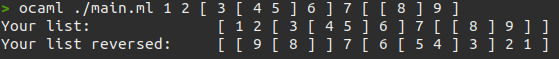

# Deep list reverse

## Requirements
Reverse the input list (taking in account that the list can contain sub lists).
The list structure must not be modified.

## Usage

```bash
ocaml ./main.ml <your list with brackets> 
```

## Examples

