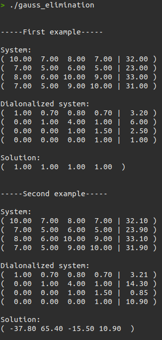
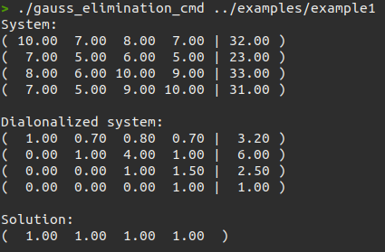

# Systems of Linear Equations: Gaussian Elimination

## Requirements
1. Define the vect type, mat type and syst type;
2. Write functions for controlling vectors: 
    - displaying a system on a screen; 
    - adding two vectors;
    - multiplying a vector by a scalar.
3. Write functions for matrix calculations: 
    - multiplication of two matrices;
    - product of a matrix by a vector;
4. Write functions for managing systems:
    - splitting a system line into an axis;
    - swapping two lines.
5. Write a function to diagonalize the system. 
From here we get a function that solves the linear system.

## Usage

### For solving the example's systems

```bash
make gauss_elimination
./gauss_elimination
```

### For solving a system from an input file

```bash
make gauss_elimination_cmd
./gauss_elimination_cmd <path to file with a system>
```

## Examples

### For solving the example's systems



### For solving a system from an input file

