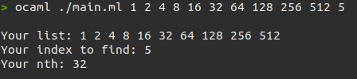

# N-th element in a list

## Requirements
Find n-th element in the input list, and return the element. 
Numeration of the list starts from 0.

## Usage

```bash
ocaml ./main.ml <your list> <index of the n-th element>
```

## Examples

