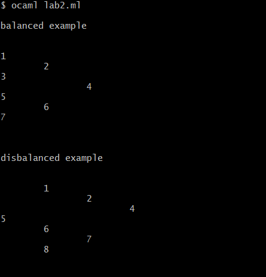

# Trees manipulation

## Requirements
1. Write a function that takes a binary tree of type `'a bin_tree` and an array 
(which is considered large enough) as an input. 
The function saves the values from the tree to the array as follows:
for a node with the "i" position, the left subtree lies in the interval `[i+1, i+1+2^h]`,
 and the right subtree lies in the interval `[i+1+2^h+1, 2^(h+1) - 1]`;
2. Write a function to create a leaf (tree with a height of 0);
3. Write a function to create a new tree from the value and two other trees;
4. Write a conversion function from type `'a bin_tree` to array;
5. Define the `left-root-right` bypass function for these trees;
6. Use this function to display the tree on the screen.

## Usage

```bash
ocaml ./main.ml
```

## Examples

